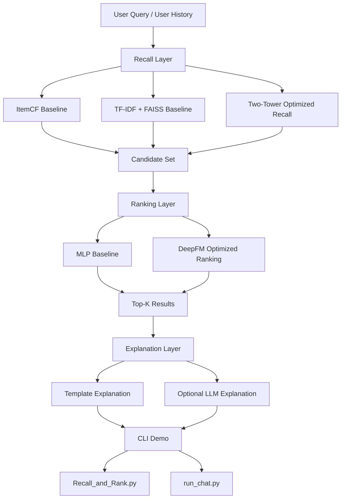

# Project Overview

## Project Positioning

This project is a MovieLens 1M recommendation-system case study organized around the standard recommendation flow:

1. recall
2. ranking
3. explanation
4. online demo entry

The goal is not to build a production platform, but to present a complete and explainable recommendation project with:

- multiple recall baselines
- multiple ranking versions
- offline evaluation
- a runnable local demo

## Dataset

Dataset:

- MovieLens 1M

Raw files:

- `movies.dat`
- `ratings.dat`
- `users.dat`

Scale:

- about 1M ratings
- about 3.9K movies
- about 6K users

How the dataset is used in this project:

- `movies.dat` provides item metadata such as title and genres
- `ratings.dat` provides user-item interactions for recall and ranking
- `users.dat` is used only lightly in the current version

## Recall Layer

The recall layer currently includes three routes.

### 1. ItemCF

Role:

- collaborative recall baseline

Method:

- build item-item similarity from positive interaction co-occurrence
- use user history to retrieve similar items

Strength:

- strongest recall baseline in the current MovieLens setting

### 2. TF-IDF + FAISS

Role:

- content recall baseline

Method:

- convert title and genre text into TF-IDF vectors
- use FAISS for nearest-neighbor retrieval

Strength:

- simple and interpretable
- useful as a content baseline

### 3. Two-Tower

Role:

- recall optimization version

Method:

- learn user and item embeddings separately
- retrieve items by embedding similarity

Current status:

- training and retrieval are integrated
- current feature setup is still lightweight, so it does not yet beat ItemCF

## Ranking Layer

The ranking layer reranks candidates after recall.

### 1. MLP

Role:

- ranking baseline

Method:

- build user genre vector and item genre vector
- concatenate them and predict a click-like score with a PyTorch MLP

### 2. DeepFM

Role:

- ranking optimization version

Method:

- combine linear term, FM interaction term, and deep nonlinear layers
- use the same base feature input as the MLP baseline

Current result:

- DeepFM is consistently stronger than the MLP baseline in offline evaluation

## Explanation and Interaction Layer

Explanation:

- template-first explanation
- optional LLM fallback when OpenAI credentials are available

Interaction:

- `Recall_and_Rank.py` for quick local checking
- `run_chat.py` for command-line interaction

This keeps the project easy to reproduce without introducing extra deployment complexity.

## Experimental Conclusions

Current conclusions from offline evaluation:

- ItemCF is the strongest recall route in the current setup
- TF-IDF + FAISS is a useful but weaker content baseline
- Two-Tower completes the trainable recall route, but with current features it does not outperform ItemCF yet
- DeepFM improves over the MLP ranking baseline

This makes the project useful in interviews because it shows:

- modular recommendation-system design
- baseline and optimization thinking
- quantitative evaluation instead of only qualitative demos

## Architecture Diagram

